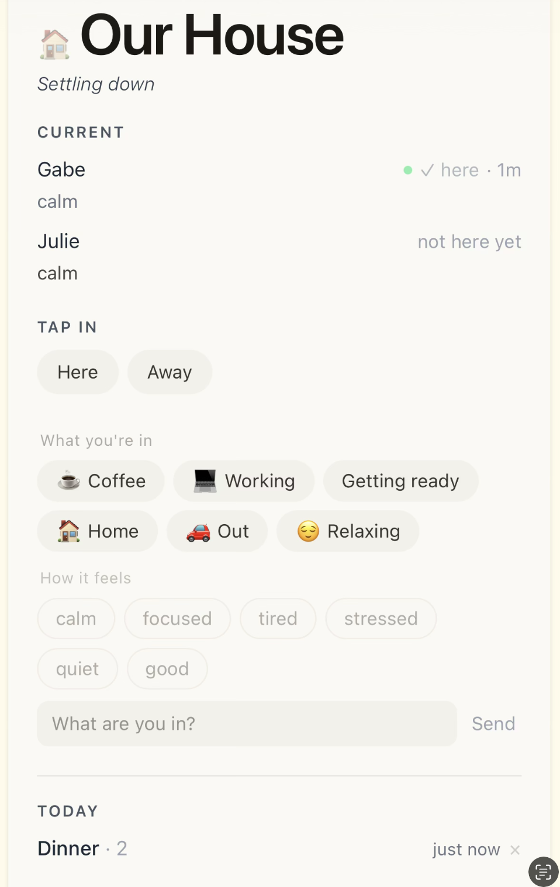

```bash
git clone https://github.com/[your-username]/glanceable
cd glanceable
npm install
cp .env.example .env.local
npm run dev
## Contributing

See [CONTRI# Glanceable

> Know when it's a good time to connect — without asking.



**https://glanceable.app**

---

## What it is

Glanceable is a presence layer for people who share space.

You tap what you're in.
The people around you see it.

No texts. No notifications. No asking.
Just a quiet signal that says — now is a good time.

---

## Why it exists

Most tools interrupt.

Glanceable doesn’t.

It makes presence visible without demanding attention.

---

## How it works

* Tap your current state (working, coffee, relaxing, out)
* Optionally add how it feels (calm, focused, tired)
* Others see a live, glanceable signal
* Shared moments accumulate into a lightweight history

That’s it.

---

## What it’s for

* couples
* families
* small groups

Anywhere people coordinate without wanting friction.

---

## What it is not

* not messaging
* not a social feed
* not a mood tracker
* not notifications
* not surveillance
* not ad-supported

---

## Philosophy

Glanceable is intentionally minimal.

* no gamification
* no engagement loops
* no optimization for attention

If it adds noise, it doesn’t belong.

---

## Tech stack

* Next.js / React / Tailwind
* Node.js
* Postgres (Supabase)
* Vercel

---

## Running locally

```bash
git clone https://github.com/mralexellerman-dot/Glanceable
cd Glanceable
npm install
cp .env.example .env.local
npm run dev
```

## Contributing

See [CONTRIBUTING.md](./CONTRIBUTING.md)

## Status

Early MVP.  
Actively being built.

Expect rough edges.